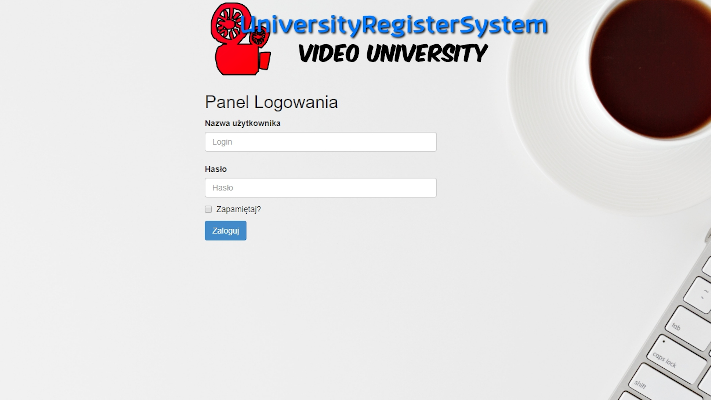

# UniversityRegisterSystem
> Aplikacja Wirtualny Dziekanat, projekt został zrealizowany w celu zaliczenia przedmiotu - WSEI K.

One to two paragraph statement about your product and what it does.



Logowanie

W celu zalogowania się do Panelu należy wprowadzić dane do logowania.
Przykład testowy:
Login: admin
Hasło: admin

Dashboard

Po prawidłowym zalogowaniu zostaniemy przeniesiemy do głównej strony aplikacji,
w celu poruszania się należy z drop-down menu wybrać sekcję.

Uczniowie

W zakładce /Student możemy podejrzeć aktualnych studentów, edytować, usunąć lub dodać nowego.
W celu dodania nowego studenta udajemy się pod podstronę /Student/Create w której wypełniamy wymagane pola 
w celu dodania nowego rekordu do bazy danych.


Nauczyciele

W zakładce /Nauczyciele możemy podejrzeć aktualnych nauczycieli, edytować, usunąć lub dodać nowego.
W celu dodania nowego nauczyciela udajemy się pod podstronę /Teacher/Create w której wypełniamy wymagane pola 
w celu dodania nowego rekordu do bazy danych.


Zajęcia

W zakładce /Course możemy podejrzeć aktualne zajęcia, edytować, usunąć lub dodać nowe.
W celu dodania nowego zajęcia udajemy się pod podstronę /Course/Create w której wypełniamy wymagane pola 
w celu dodania nowego rekordu do bazy danych.

Statystyki

W zakładce /Statistics możemy podejrzeć kiedy zostali przyjęci nowi studenci na podstawie pobrania rekordów z tabeli dbo.Student z pola EnrollmentDate

## Jak zainstalować?

1. Pobierz aplikację z linku poniżej:

```sh
https://mega.nz/#!iBFxSIrL!sBbOXvstW6WFAQ32L9HuXYJHCsQ_Fr4ysihvjVdHRtA
```

2. W celu prawidłowego działania aplikacji pobierz niezbędny plik bazy danych, oraz wklej go do folderu C:\Users\Nazwa_Użytkownika:

```sh
https://mega.nz/#!3IEzSIbT!S3Rdqx7G5YrTY3qpkibYLd8iyF4DZ__hPX8FnJcnUrM
```

3. Po włączeniu projektu w programie Visual Studio, podmień connectionStrings plik Web.config podając swoją nazwą użytkownika w ścieżce pliku z kroku 2:

```sh
  <connectionStrings>
    <add name="SchoolContext" connectionString="Data Source=(LocalDb)\MSSQLLocalDB;AttachDbFileName=C:\Users\bigme\UniveristyRegisterSystem4.mdf;Integrated Security=SSPI;" providerName="System.Data.SqlClient" />
  </connectionStrings>
  ```

## Diagram bazy danych


## Autorzy

[https://github.com/KamilOles1997](https://github.com/KamilOles1997)
[https://github.com/DawidS0](https://github.com/DawidS0)
[https://github.com/RJalocha](https://github.com/RJalocha)

